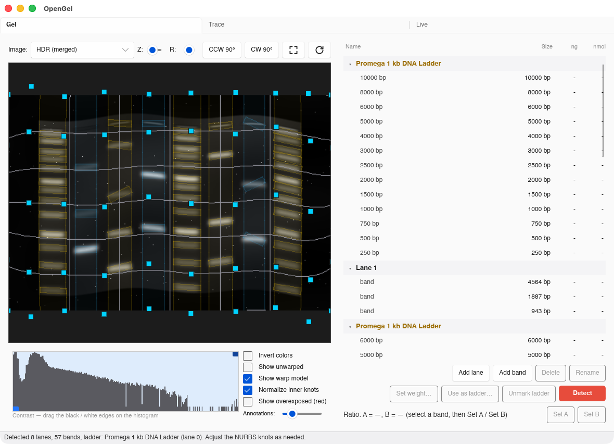
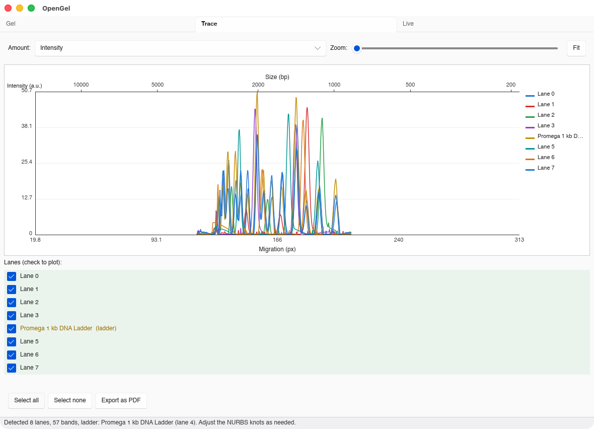

# OpenGel

Capture, detect and quantify gel electrophoresis images

**under development! possibly already working**

**Features:**

* Supports **DNA, RNA and protein** gels.
* Camera snapshots, including multi-exposure **HDR** for dynamic range
* Detection of bands using ML, and gaussian mixture distribution to figure out if the are at an angle. The gel is modelled by [NURBS](https://en.wikipedia.org/wiki/Non-uniform_rational_B-spline), fitting band angles and ladder band positions
* Quantification of densitys and molarities, taking gel warping into account
* Quick compute of relative mass and molarity ratios

**File formats:**

| Format | Read | Write |
|---|:--:|:--:|
| `.gel.zip` — OpenGel's own container (images, analysis, metadata) | ✅ | ✅ |
| `.scn` / `.mscn` — Bio-Rad Image Lab scan, single- and multi-channel | ✅ | — |
| `.sscn` / `.smscn` — Image Lab "secured" scan (same container, signed) | ✅ | — |
| PNG, JPEG, TIFF, BMP and friends — a loose image, imported as one gel | ✅ | — |
| PDF — report of the current analysis | — | ✅ |

Image Lab scans are read whole: 16-bit pixels, every channel, and the
instrument's acquisition record (exposure, application, excitation source,
emission filter, serial number). A multi-channel scan opens as one gel with a
channel selector — the channels share lane and band geometry, because they are
the same gel photographed under different light. Everything the file recorded
about how it was taken is shown in the **Metadata** tab.

The "secured" variants are not encrypted — they carry an extra unkeyed MD5 of
their own contents, which the reader ignores — so they read like any other scan.

**Hardware support:**

* All auto-discoverable cameras through [nu-manager](https://github.com/henriksson-lab/numanager),
* Plain USB webcams (UVC), for framing a gel with whatever is at hand
* **Bio-Rad Gel Doc EZ** imaging enclosures (and the Criterion Stain Free, which
  shares its command set) — see below
* If you want support for another camera, make a github issue on the nu-manager repository

## Gel Doc EZ

A Gel Doc EZ is a darkroom *around* a camera, not a camera: it senses which
sample tray is inserted (which is what selects the light source), gates the
lamps on the door interlock, latches faults and carries a front Run button. Its
own **Gel Doc EZ** tab drives all of that, while the camera inside it is picked
from the same list as any other camera.

The tab covers instrument status, the live tray and door state, the fault list
with remedies, applications (sample type × reagent, with the tray each implies),
auto exposure — *intense bands* to keep everything quantifiable, *faint bands* to
lift the faint end and let the brightest clip — or manual exposure over the
instrument's 0.001–10 s range, stain-free gel activation, and saved protocols
with one default per tray bound to the hardware Run button.

An exposure interrupted by the door opening is discarded, not saved: the
instrument latches that condition, and an image taken across it is not data.

The enclosure is a plain USB HID device, so on Linux it needs only `hidraw`
access:

```sh
gel udev-rules | sudo tee /etc/udev/rules.d/60-opengel.rules
sudo udevadm control --reload-rules && sudo udevadm trigger
```

With no instrument attached the tab offers a **simulated Gel Doc EZ** that
answers the same wire protocol, including a bench panel for moving the tray,
opening the door, injecting faults and pressing the Run button — the whole tab
is usable, and testable, without hardware.





## Build & run

The pretrained band-detection model (`assets/models/*.bpk`) is stored with
[Git LFS](https://git-lfs.com), so you must install it **before** cloning (or
run `git lfs pull` after) — otherwise you only get a small pointer file and the
build/run fails to load the model.

```sh
# Install Git LFS, then fetch the model weights:
brew install git-lfs          # macOS  (Linux: sudo apt-get install git-lfs)
git lfs install               # once per machine
git lfs pull                  # download the model into an already-cloned repo
```

```sh
cargo build --release             # optimized build (USB camera backend on by default)

# GUI (the default binary)
cargo run --release

# CLI
cargo run --release --bin gel
```

The crate ships two binaries — `opengel` (the desktop GUI) and `gel` (the CLI).
`default-run` points bare `cargo run` at the GUI; pass `--bin gel` for the CLI.
The USB camera backends are on by default on every platform. The webcam backend
needs `libv4l-dev` at build time on Linux (`sudo apt-get install libv4l-dev`);
build with `--no-default-features` to drop it for a headless build without the
v4l toolchain. nu-manager's cameras need no build-time system deps, but on Linux
they do need raw USB access. The Debian package installs the udev rules for you;
for a raw binary install, generate and install them yourself:

```sh
cargo run --release --bin gel -- udev-rules \
  | sudo tee /etc/udev/rules.d/60-opengel-numanager.rules
sudo udevadm control --reload-rules && sudo udevadm trigger --subsystem-match=usb
# then replug the camera
```

The rules are *generated*, not checked in: `gel udev-rules` derives them from
nu-manager's own list of claimed USB vendor ids — the same declaration that
decides which drivers probe the bus — so they cannot fall behind as nu-manager
gains device support. Regenerate after updating nu-manager.


## Citing

The initial detection of bands is done using the pretrained ML model of [GelGenie](https://github.com/mattaq31/GelGenie),
converted to Rust and adapted for the NURBS model. It is an important component and it would thus be
fair you could cite:

> Aquilina, M., Wu, N. J. W., Kwan, K., Bušić, F., Dodd, J., Nicolás-Sáenz, L.,
> O'Callaghan, A., Bankhead, P., & Dunn, K. E. (2025). GelGenie: an AI-powered
> framework for gel electrophoresis image analysis. *Nature Communications*, 16,
> 4087. https://doi.org/10.1038/s41467-025-59189-0

In addition, please cite this git repository. So you could write something like:
*Gels were analyzed using https://github.com/henriksson-lab/opengel, using GelGenie[1] for band detection*


## License

* Code is by default under MIT license
* Code under src/gelgenie is a Rust conversion of [GelGenie](https://github.com/mattaq31/GelGenie), which is under Apache-2.0 license.

Note that code has been produced using agentic AI; in case you
wish to copy out any part of the code, please first please review
the code for accidental reuse of copyrighted material.
